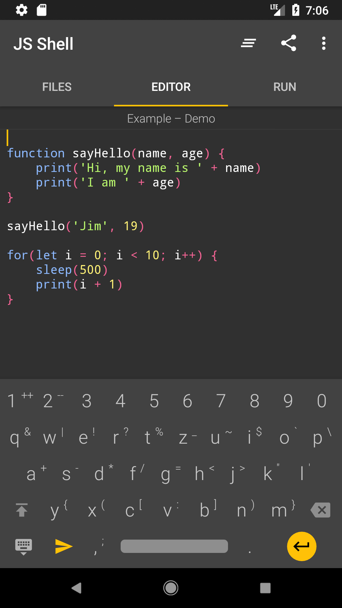

# JavaScript Shell


> A JavaScript editor and execution suite for Android

By Jim Eckerlein, 2017

Programmed for my school work.

The JavaScript evaluator uses the high-performance J2V8 engine, a Java binding to Google's V8 engine.

## Screenshots

### Editor



### Run


## Dev Notes - Supply an SVG Logo

Android Studio has a built-in functionality to import SVGs and convert them to pngs into mipmaps resource folders, but unfortuntlely, Android Studio is in-capable of many SVG features.

To supply any SVG manually, bypassing the Android Studio importer, use the following commands:

```bash
inkscape -z logo.svg -w 512 -h 512 -e app\src\main\ic_logo-web.png
inkscape -z logo.svg -w 48 -h 48 -e app\src\main\res\mipmap-mdpi\ic_logo.png
inkscape -z logo.svg -w 72 -h 72 -e app\src\main\res\mipmap-hdpi\ic_logo.png
inkscape -z logo.svg -w 96 -h 96 -e app\src\main\res\mipmap-xhdpi\ic_logo.png
inkscape -z logo.svg -w 144 -h 144 -e app\src\main\res\mipmap-xxhdpi\ic_logo.png
inkscape -z logo.svg -w 192 -h 192 -e app\src\main\res\mipmap-xxxhdpi\ic_logo.png
```

This requires Inkscape to be installed and added to PATH.

Replace `logo.svg` and `ic_logo` by your desired name.